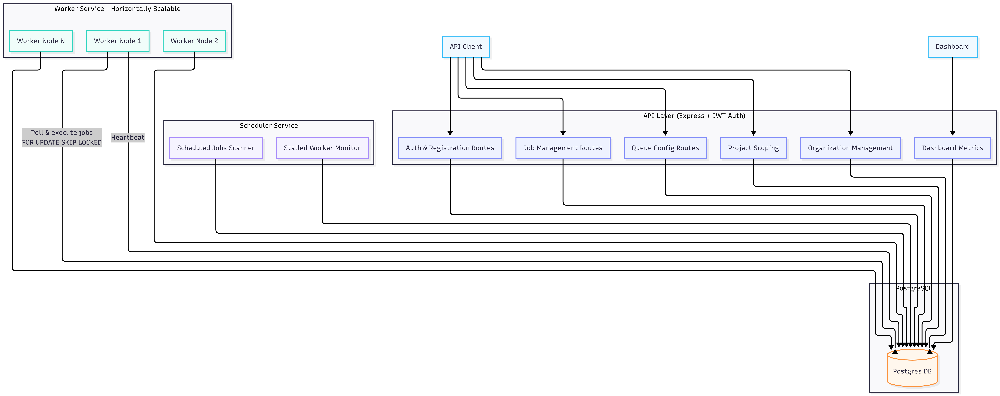

# System Architecture

## Architecture Design Notes

### Scheduler Dual Responsibility
The Scheduler process serves a dual purpose: it fires cron/recurring jobs and it detects/requeues stalled worker jobs. 
> [!WARNING]
> **Design Trade-off**: Because both of these responsibilities are bundled into the same singleton node process, if the Scheduler goes down, both cron execution and dead-worker recovery stop simultaneously. This is an accepted limitation for the scope of this project. A production-grade system would likely split these responsibilities into distinct microservices, or run redundant schedulers with a distributed leader election lock (e.g., via Redis or Postgres advisory locks).

### Distributed Worker Scaling
"Distributed" is a core premise of this architecture. The worker pool is designed to scale horizontally without any coordination bottleneck. You can scale throughput by simply spinning up additional worker processes (on the same machine or across different machines) pointed at the exact same Postgres database. The atomic `FOR UPDATE SKIP LOCKED` claim query guarantees that multiple active workers will never pick up the same job concurrently.

### API Layer & JWT Auth
The API Server handles standard CRUD routing but is also explicitly responsible for authentication and tenant isolation. It uses JWT authentication to verify users, auto-provisions their distinct Organizations, and ensures that all Queue and Job requests are correctly scoped to the user's active Project.
