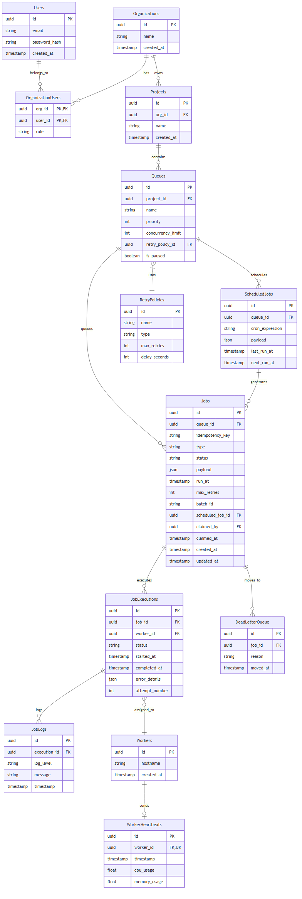

# Entity-Relationship Diagram



## Schema & Design Rationale

### Normalization
The schema adheres to typical 3NF. `Organizations`, `Users`, and `Projects` cleanly divide multi-tenant workspaces. `Queues` contain their configurations, pointing to `RetryPolicies` for shared backoff strategies.
> [!NOTE]
> **Duplicate `max_retries`**: You mighDt notice `max_retries` on both `RetryPolicies` and `Jobs`. This is intentional. `RetryPolicies` act as the default fallback for a Queue, while `Jobs.max_retries` allows an optional per-job override (used, for example, during testing to force a failure straight to the Dead Letter Queue).

### Atomic Claim Hot Path
To prevent race conditions during distributed job processing, a composite index handles the queue query fast-path:
```sql
CREATE INDEX idx_jobs_claim ON jobs (queue_id, status, run_at);
```
Claiming ownership (`claimed_by`, `claimed_at`) is written directly onto the `Jobs` row in the same `FOR UPDATE SKIP LOCKED` query that changes its status to `claimed`. This eliminates gaps where a worker has locked a job but the ownership isn't traceable.

### Worker Liveness & Heartbeat Retention
Workers explicitly **do not** have an `active`/`dead` status column saved in the database. Their liveness is dynamically derived entirely from `worker_heartbeats.timestamp`. 
> [!TIP]
> The `worker_heartbeats` table retains only the single most recent heartbeat per worker. A Unique Key constraint on `worker_id` enables an `UPSERT` pruning strategy, preventing the table from unbounded growth.

### Cascade Rules
- `CASCADE` is used heavily downwards: deleting an `Organization` drops its `Projects`, which drops `Queues`, which gracefully drops `Jobs`, `ScheduledJobs`, and `JobExecutions`.
- `RESTRICT` is used for `RetryPolicies` against `Queues` to prevent accidental deletion of a retry strategy while it's in use.
- `SET NULL` is used for `claimed_by` and `scheduled_job_id` on `Jobs` to ensure that if a Worker dies and its row is pruned (or a Cron is deleted), the historical job records don't catastrophically disappear, retaining audit history.
