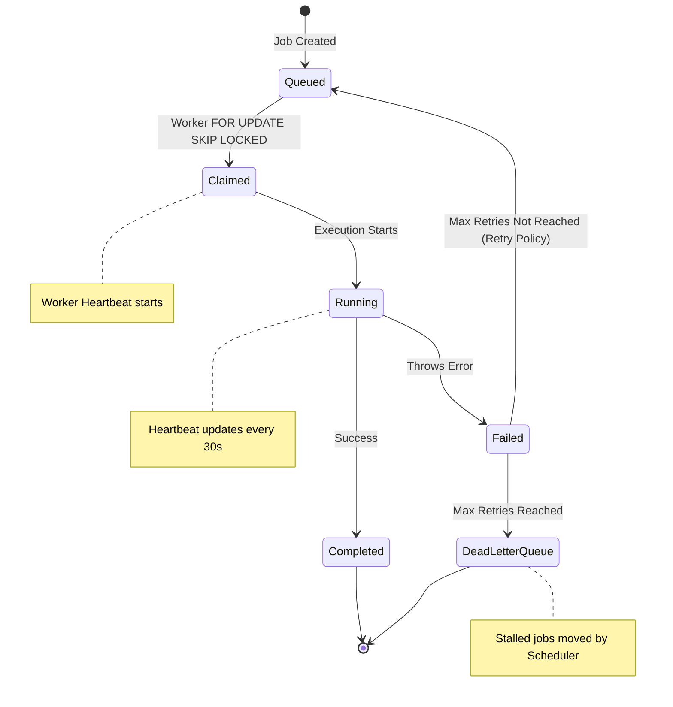

```mermaid
stateDiagram-v2
    [*] --> Queued : Job Created
    Queued --> Claimed : Worker FOR UPDATE SKIP LOCKED
    Claimed --> Running : Execution Starts
    Running --> Completed : Success
    Running --> Failed : Throws Error
    
    Failed --> Queued : Max Retries Not Reached (Retry Policy)
    Failed --> DeadLetterQueue : Max Retries Reached
    
    Completed --> [*]
    DeadLetterQueue --> [*]
    
    note right of Claimed: Worker Heartbeat starts
    note right of Running: Heartbeat updates every 30s
    note right of DeadLetterQueue: Stalled jobs moved by Scheduler
```
